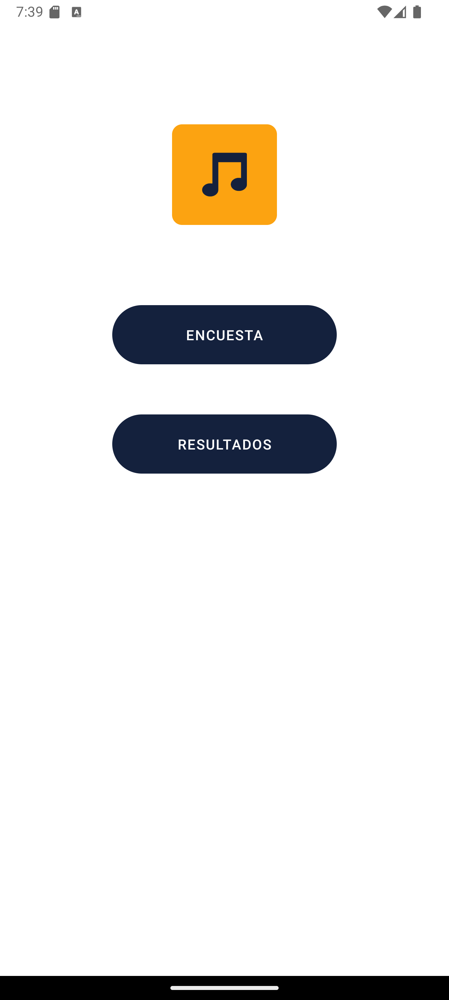
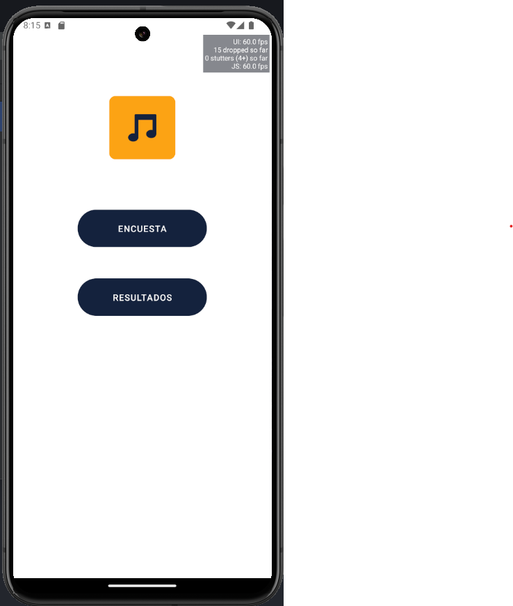
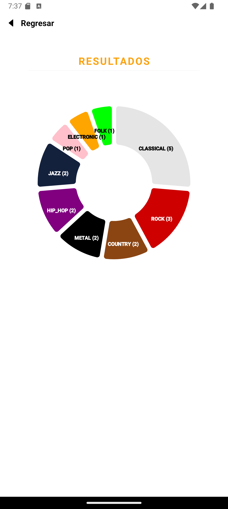

# Test - React Native + Spring Boot

## Frontend

1. Instalar dependencias: `npm install --force`
2. Levantar Metro Bundler: `npm start`
3. Iniciar App
   1. (OPCION 1) Usar Expo Go y escanear el codigo QR.
   2. (OPCION 2) Utilizar Emulador Android Studio (Windows)
4. Ejecutar tests: `npm run test`

## Backend

### Local Environment
1. Abrir proyecto en IntelliJ e instalar dependencias
2. Correr `BackendApplication`
3. Consumir API: `http://localhost:8080/api/v1`

## Screens
  
  
  
